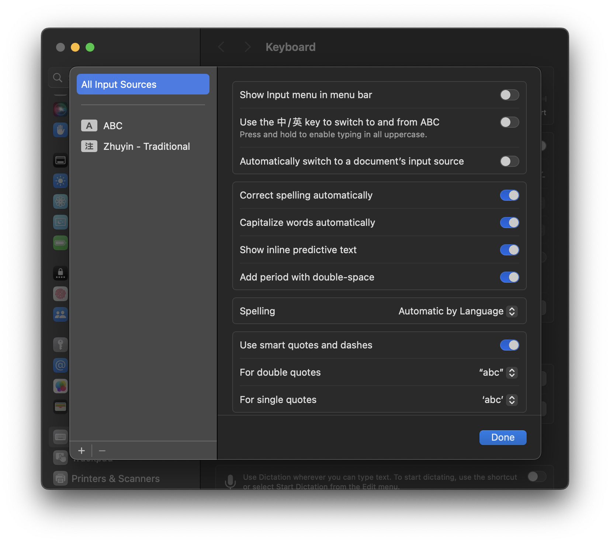
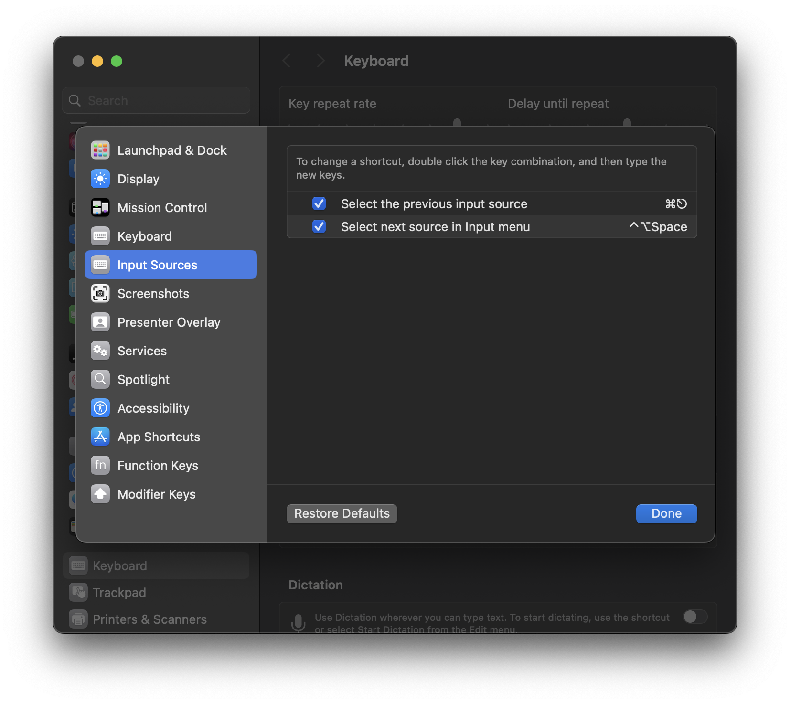

+++
title = "解決 MacOS 中英切換時的輸入錯誤"
date = 2024-07-09
updated = 2024-07-09
description = "改善 MacOS 中英輸入法切換的效率與準確性"

[taxonomies]

tags = ["memo", "macos"]

[extra]
quick_navigation_buttons = true
footnote_backlinks = true 
social_media_card = "/img/social_card.jpg"
+++

    
<b>Table of Contents</b>

    <!-- toc -->

---

## MacOS 中英輸入的缺點

我在使用 MacOS 系統做日常開發已經好幾年了，但在中英切換的時候老是卡來卡去，通常在軟體開發的情境之下，大部分時間只需要輸入英文，所以一直以來我也就不以為意 ~~(逃避)~~

但隨著我推了幾個好同事從 Windows 系統轉換到 MacOS 後，我發現他們都覺得切換輸入法導致的小狀況很是困擾

秉持著畢竟人家都被我推坑了，售後服務要做好的原則，我終於認真找資料來解決這個問題 😂

---

> 實際開始行動前，先整理一下個人在 MacOS 系統下切換中英輸入法的時候，最常遇到兩個問題

1.  **切換的速度很慢，有時甚至需要等到 1 秒以上**
2.  **用 `Caps Lock` 切換後，偶爾會在切換過程中失敗，導致輸出全形英文**

簡單搜尋後，發現網路上已經很多大大發現，出現這情況的原因是因為：

> `Caps Lock` 除了中英切換功能還帶著大小寫轉換功能 
> 使得切換時有時會因為兩個功能衝突而導致切換失敗 ~~(是說這失敗頻率根本就是 bug 吧)~~

但解決方式也比想像中簡單，只要把 `Caps Lock` 的中英切換取消，然後把原本的語言切換功能改為其他映射就好

### 1. 取消中英切換

> 直接將 `中/英` 的選項關閉

### 2. 重新綁定中英切換功能

> 我這邊將原先切換中英的 `Caps Lock` 改為 `cmd + escape`，可以自由選擇映射方式

---

## 結論

調整完之後，再也沒遇到尷尬的全形英文，切換中英的速度也提升，停頓感減少很多

另外在真實使用情境裡，鍵盤預設的輸入法可以直接是中文，因為中文模式時，再使用 `Caps Lock`，就可以在維持中文輸入法的情境之下，快速切換為輸出 **小寫半形英文** !

這對於我來說也不需用 `cmd + escape` 來切換輸入法了，只需維持中文模式就可以同時輸入 **半形大小寫英文、中文** 等需求，相較以前要一直 `Caps Lock` 切換輸入法，省去了很多時間

整體來說，最需要適應的是要重新熟悉切換輸入法的方式，但改完後也降低的切換語言的頻率，個人使用上覺得這個 trade off 十分值得!!
